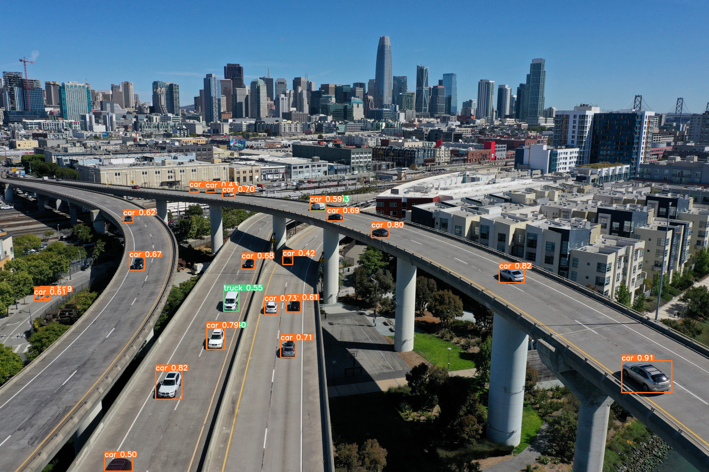

<div align="center">
<h1>
YOLOv6: Single-stage Object Detection</h1>

</div>


### Installation
```shell
git clone --recurse-submodules https://github.com/kadirnar/YOLOv6.git
cd YOLOv6
pip install -r requirements.txt
```

### Inference
```shell
detection_model = Yolov6(
    model_path="yolov6s.pt",
    source="assert/highway.jpg",
    img_size=1280,
    conf_thres=0.3,
    device="cpu",
)
detection_model.inference()
```

### Training

Single GPU

```shell
python YOLOv6/tools/train.py --batch 32 --conf configs/yolov6s.py --data data/coco.yaml --device 0
                                         configs/yolov6n.py
```

Multi GPUs (DDP mode recommended)

```shell
python -m torch.distributed.launch --nproc_per_node 8 YOLOv6/tools/train.py --batch 256 --conf configs/yolov6s.py --data data/coco.yaml --device 0,1,2,3,4,5,6,7
                                                                                        configs/yolov6n.py
```

- conf: select config file to specify network/optimizer/hyperparameters
- data: prepare [COCO](http://cocodataset.org) dataset and specify dataset paths in data.yaml


### Evaluation

Reproduce mAP on COCO val2017 dataset

```shell
python YOLOv6/tools/eval.py --data data/coco.yaml  --batch 32 --weights yolov6s.pt --task val
                                                                 yolov6n.pt
```


### Deployment

*  [ONNX](./deploy/ONNX)
*  [OpenVINO](./deploy/OpenVINO)

### Tutorials

*  [Train custom data](./docs/Train_custom_data.md)
*  [Test speed](./docs/Test_speed.md)


## Benchmark


| Model           | Size        | mAP<sup>val<br/>0.5:0.95 | Speed<sup>V100<br/>fp16 b32 <br/>(ms) | Speed<sup>V100<br/>fp32 b32 <br/>(ms) | Speed<sup>T4<br/>trt fp16 b1 <br/>(fps) | Speed<sup>T4<br/>trt fp16 b32 <br/>(fps) | Params<br/><sup> (M) | Flops<br/><sup> (G) |
| :-------------- | ----------- | :----------------------- | :------------------------------------ | :------------------------------------ | ---------------------------------------- | ----------------------------------------- | --------------- | -------------- |
| [**YOLOv6-n**](https://github.com/meituan/YOLOv6/releases/download/0.1.0/yolov6n.pt)    | 416<br/>640 | 30.8<br/>35.0            | 0.3<br/>0.5                           | 0.4<br/>0.7                           | 1100<br/>788                             | 2716<br/>1242                             | 4.3<br/>4.3     | 4.7<br/>11.1   |
| [**YOLOv6-tiny**](https://github.com/meituan/YOLOv6/releases/download/0.1.0/yolov6t.pt) | 640         | 41.3                     | 0.9                                   | 1.5                                   | 425                                      | 602                                       | 15.0            | 36.7           |
| [**YOLOv6-s**](https://github.com/meituan/YOLOv6/releases/download/0.1.0/yolov6s.pt)    | 640         | 43.1                     | 1.0                                   | 1.7                                   | 373                                      | 520                                       | 17.2            | 44.2           |


- Comparisons of the mAP and speed of different object detectors are tested on [COCO val2017](https://cocodataset.org/#download) dataset.
- Refer to [Test speed](./docs/Test_speed.md) tutorial to reproduce the speed results of YOLOv6.
- Params and Flops of YOLOv6 are estimated on deployed model.
- Speed results of other methods are tested in our environment using official codebase and model if not found from the corresponding official release.